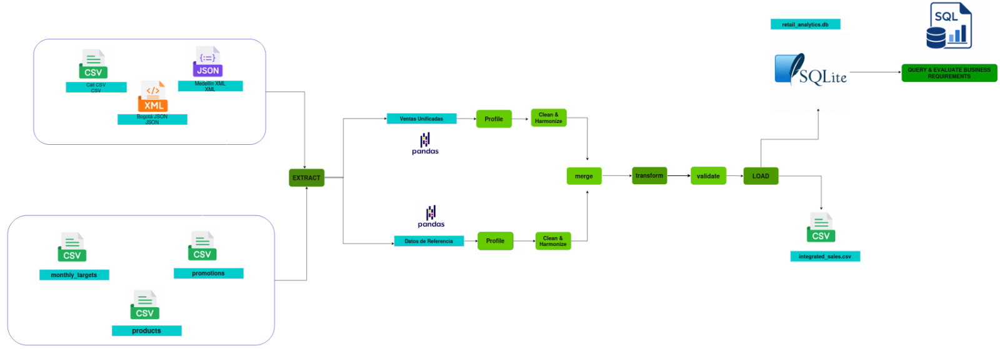

# Retail Analytics ETL Pipeline (Lab 1B)

## 1. Project Overview
This project implements a basic ETL (Extract, Transform, Load) pipeline to integrate heterogeneous retail data sources (CSV, JSON, XML) from different branches into a structured analytical repository. The resulting SQLite database powers analytical queries that help managers make strategic decisions.

# 2. System Architecture
The ETL pipeline follows a modular, block-based architecture.



*(See `docs/pipeline_diagram.md` for the interactive Mermaid version.)*

## 3. Selected Business Requirements
1. **Total Revenue by Month**: Track overall sales performance over time.
2. **Top-selling Products**: Identify the highest-grossing products.
3. **Product Performance (Sales by Category)**: Understand which product categories drive the most revenue.
4. **Sales by Region and Store**: Geographic breakdown of performance.
5. **Store Target Performance**: Evaluate which stores met or missed their monthly sales targets.
6. **Sales Trend Over Time (Weekly)**: Granular view of weekly progress.

### Requirements Traceability Table

| Business Requirement | Required Data | Pipeline Block | Expected Output |
|---|---|---|---|
| Total Revenue by Month | `sale_date`, `net_sales` | Transform/Integrate → Query | Table with month and summed revenue |
| Top-selling Products | `product_id`, `quantity`, `net_sales`, `products.csv` | Transform/Integrate → Query | Top 5 products by revenue and units sold |
| Sales by Category | `product_id`, `category` (products.csv), `net_sales` | Transform/Integrate → Query | Revenue and transaction count per category |
| Sales by Region and Store | `store_id`, `region`, `city` (stores.csv), `net_sales` | Transform/Integrate → Query | Revenue grouped by region and store |
| Store Target Performance | `store_id`, `net_sales`, `monthly_targets.csv` | Transform/Integrate → Validate → Query | Actual sales vs. target comparison (Met/Missed) |
| Sales Trend Over Time (Weekly) | `sale_date`, `net_sales` | Transform/Integrate → Query | Revenue grouped by week |

## 4. ETL Pipeline Description
- **Extract**: Reads transactions from Cali (`.csv`), Bogotá (`.json`), and Medellín (`.xml`), along with reference data, converting them to a common pandas DataFrame schema.
- **Profile & Clean**: Standardizes text case (e.g., uppercase IDs), parses dates, drops duplicates, and removes invalid records.
- **Transform & Integrate**: Joins transactions with product, store, and promotion details. Calculates derived fields like `gross_sales`, `discount_amount`, and `net_sales`.
- **Validate**: Enforces data integrity checks (e.g., matching foreign keys, no nulls in required fields).
- **Load**: Stores the final integrated dataset in `data/processed/integrated_sales.csv` and loads it into a SQLite database (`retail_analytics.db`).
- **Query**: Executes analytical SQL queries on the final database to satisfy the business requirements.

### Profiling Findings (Activity 4)
- Total records extracted: 763 (Cali: CSV, Bogotá: JSON, Medellín: XML)
- Missing values: 0 in required fields; 718 nulls in `promotion_code` (most sales had no promotion applied)
- Duplicate `sale_line_id` values found: 3
- After cleaning: 755 valid rows (8 rows removed: duplicates + invalid quantity/price/date)

These findings directly justify the cleaning rules applied: duplicate removal (keep first valid occurrence), and consistent handling of missing promotion codes (filled as `'None'`).
**Key data quality issue discovered:** Each branch exported dates in a different format/convention (Cali: `YYYY-MM-DD`, Bogotá: `DD/MM/YYYY`, Medellín: `MM-DD-YYYY`). Initially parsing all dates together with `pd.to_datetime(format='mixed')` caused ambiguous dates (day ≤ 12) to be misinterpreted, spreading transactions incorrectly across all 12 months instead of only Feb-Apr 2026. Fixed by parsing each source's date column explicitly in `extract.py` using its known format, before combining sources. This also correctly surfaced one genuinely invalid date from Medellín (`31-04-2026`, an impossible month=31), which is now dropped during cleaning as required by Activity 5.

## 5. Project Structure
```text
Lab1B_ETL/
├── raw/                       # Raw input datasets (Cali, Bogota, Medellin, reference tables)
├── data/
│   └── processed/             # Final integrated CSV
├── database/                  # SQLite database storage
│   └── retail_analytics.db
├── logs/                      # Pipeline execution logs (generated on run)
│   └── pipeline.log
├── src/                       # Source code for the ETL blocks
│   ├── extract.py
│   ├── transform.py
│   ├── load.py
│   ├── queries.py
│   └── main.py
├── docs/                      # Documentation files
│   ├── pipeline_diagram.md
│   └── pipeline_diagram.png
├── README.md                  # This file
```

## 6. Execution Instructions
Ensure you have Python installed along with the required libraries (e.g., pandas, lxml). From the project root, run:
```bash
python src/main.py
```
This single command will execute the entire pipeline from extraction to analytical queries.

## 7. Technologies Used
- **Python**: Core programming language.
- **Pandas**: Data manipulation and transformation.
- **lxml/etree**: XML parsing.
- **SQLite3**: Lightweight analytical database.
- **SQL**: Analytical querying.

## 8. Example Analytical Results

1. Total Revenue by Month
  month  total_revenue
2026-02     62867700.0
2026-03     60919160.0
2026-04     57004000.0

2. Top-selling Products
        product_name  total_units_sold  total_revenue
        Air Fryer 4L                84     32292000.0
        Blender 500W               127     22225000.0
 Wireless Headphones               101     21874600.0
Coffee Maker Premium                55     15675000.0
          Hair Dryer               102     13284000.0

---

## Activity 11 – Verification of Requirements

| Business Requirement | Evidence Produced | Satisfied? | Explanation |
| --- | --- | --- | --- |
| Total Revenue by Month | SQL query result grouping `net_sales` by `month` | Yes | Shows the sum of `net_sales` aggregated per month. |
| Top-selling Products | SQL query ordering products by `total_revenue` | Yes | Identifies the top 5 products based on their historical revenue. |
| Sales by Category | SQL query grouping `net_sales` by `category` | Yes | Shows total revenue and transaction count for each product category. |
| Sales by Region and Store | SQL query aggregating sales by `region` and `store` | Yes | Allows comparison of total revenue across different geographical areas. |
| Store Target Performance | SQL query joining `sales_analytics` with `monthly_targets` | Yes | Calculates the difference between actual revenue and target, tagging as "Met/Exceeded" or "Missed". |
| Sales Trend Over Time (Weekly) | SQL query grouping `net_sales` by `week` | Yes | Shows week-by-week aggregated revenue to spot trends. |

---

## Activity 12 – Reflection Questions

1. **How did the requirements from Lab 1A influence the design of the pipeline?**
   They dictated which data to extract, how to integrate it (e.g., we needed to join with `monthly_targets`), and what transformations were needed (like calculating `net_sales` and extracting `month`/`week`) so that the final queries could easily retrieve the required insights.

2. **What is the difference between profiling, cleaning, transformation, and validation in your implementation?**
   - **Profiling**: Understanding the shape and issues of the raw data (e.g., checking for nulls or duplicates).
   - **Cleaning**: Fixing the issues found (e.g., trimming spaces, handling nulls, enforcing types).
   - **Transformation**: Modifying the data structure and creating new value (e.g., joining tables, calculating `net_sales`).
   - **Validation**: Enforcing hard rules before saving (e.g., ensuring `store_id` has a match in the reference table).

3. **Why was it necessary to design the system as blocks before coding?**
   It allows for modularity and separation of concerns. Designing blocks beforehand ensures we know the inputs and outputs of each step, making debugging easier and ensuring the pipeline scales predictably.

4. **Which block would be most affected if a branch changed its file format?**
   The **Extract** block. We would only need to update the specific function reading that branch's data, while the rest of the pipeline (transform, validate, load) would remain completely untouched.

5. **Did the team build an ETL pipeline, or did it build a system to solve a business problem? Explain.**
   We built a system to solve a business problem. The ETL pipeline is just the technical mechanism. The ultimate goal was to provide an analytical database capable of answering the specific strategic questions (KPIs) posed by management in Lab 1A.
