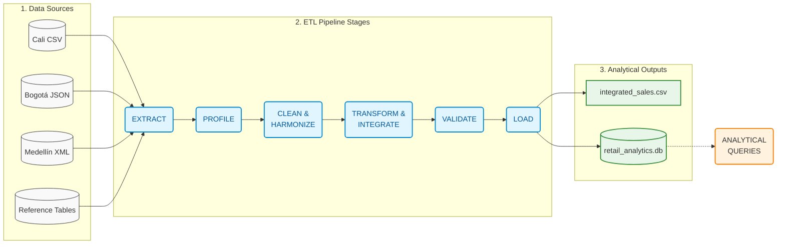

# ETL Pipeline Architecture

## 1. Block Diagram.

El siguiente diagrama ilustra el flujo de los datos desde que son extraídos de los sistemas origen, hasta que son cargados en la base de datos analítica.

---

## 2. Pipeline Blocks Definition

Para mantener el sistema ordenado, cada bloque tiene una única responsabilidad y una salida específica.

| Block (Bloque) | Input (Entrada) | Processing Responsibility (Responsabilidad) | Output (Salida) | Possible Failure (Posible Fallo) |
| :--- | :--- | :--- | :--- | :--- |
| **Extract** | Archivos crudos (CSV, JSON, XML) | Leer y estandarizar datos de diferentes formatos hacia una estructura común (Pandas DataFrame) sin aplicar cálculos de negocio. | Pandas DataFrames Crudos | Archivo no encontrado, o error al leer (parsing error). |
| **Profile** | DataFrames Crudos | Analizar estadísticamente los datos extraídos para descubrir problemas de calidad (nulos, duplicados, datos inválidos). | Resumen de Perfilamiento | *No altera datos, usualmente no falla.* |
| **Clean & Harmonize** | DataFrames Crudos | Estandarizar formatos (IDs en mayúsculas), corregir datos inválidos, manejar valores nulos y eliminar duplicados. | DataFrames Limpios | Exceso de registros inválidos causando pérdida masiva de datos. |
| **Transform & Integrate** | DataFrames Limpios + Tablas Referencia | Cruzar ventas con las referencias (Productos, Tiendas, Promos) y calcular KPIs de negocio (`gross_sales`, `net_sales`, fechas). | DataFrame Integrado | IDs huérfanos (ej: se vendió un producto que no existe en el catálogo). |
| **Validate** | DataFrame Integrado | Comprobar reglas críticas antes de guardar: campos no nulos, IDs únicos, precios no negativos, que cruces de tablas cuadren. | DataFrame Validado | Violación de regla crítica (detiene el pipeline para no ensuciar la BD). |
| **Load** | DataFrame Validado | Guardar el dataset limpio en almacenamiento persistente (CSV) y en la base de datos analítica final (SQLite). | `integrated_sales.csv` y `retail_analytics.db` | Fallo de conexión a la base de datos o disco lleno. |
| **Query** | `retail_analytics.db` | Ejecutar consultas SQL (Analytical Queries) enfocadas en responder las preguntas de negocio. | Tablas de Resultados / Reportes | Error de sintaxis SQL o tablas no encontradas. |
